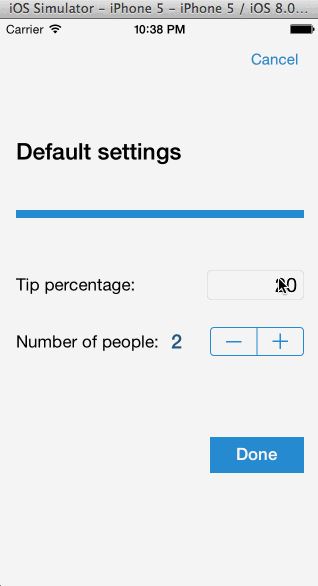

TipCalculator
=============

* User is displayed the tip of specified percentage for specified entered amount
* User enters the total amount of the transaction
* User can select custom tip percentage (i.e 10%, 15%, 20%)
* Upon selecting tip amount, formatted tip value is displayed
* User changes the total amount and updated tip is reflected automatically
* (Optional) User can select how many ways to split the tip
* (Optional) User can edit preset tip percentages and have them persist across launches
* (Optional) Improve the user interface and experience by using images and/or colors

